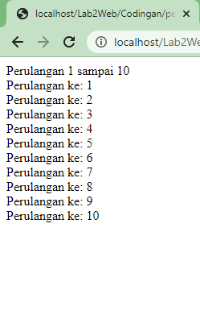

# LANGKAH LANGKAH PRAKTIKUM
## STRUKTUR   <p>

1. Menjalankan Web Server
 <p>
2. Membuat direktory tersebut pada web server :
 <p>
3. PHP Dasar <p>
Buat file baru dengan nama php_dasar.php pada directory tersebut. Kemudian buat kode seperti
berikut.
```javascript
<!DOCTYPE html>
<html lang="en">
<head>
<meta charset="UTF-8">
<title>PHP Dasar</title>
</head>
<body>
<h1>Belajar PHP Dasar</h1>
<?php
echo "Hello World";
?>
</body>
</html>

<body>
<h1>Menggunakan Variable</h1>
<?php
$nim = "312110381";
$nama = 'Refi Daus Nur Trama';
echo "NIM : " . $nim . "<br>";
echo "Nama : $nama";
?>
```
 <p>
4. Variable PHP<p>
Menambahkan variable pada program.
```javascript
<?php
$nim = "0411500400";
$nama = 'Abdullah';
echo "NIM : " . $nim . "<br>";
echo "Nama : $nama";
?>
```
 <p>
5. Predefine Variable<p>
```javascript
<?php
echo 'Selamat Datang ' . $_GET['nama'];
?>
```
 <p>
5. Membuat From Input<p>
```javascript
<!DOCTYPE html>
<html lang="en">
<head>
<meta charset="UTF-8">
<title>PHP Dasar</title>
</head>
<body>
<h2>Form Input</h2>
<form method="post">
<label>Nama: </label>
<input type="text" name="nama">
<input type="submit" value="Kirim">
</form>
<?php
echo 'Selamat Datang ' . $_POST['nama'];
?>
</body>
</html>
```
 <p>
6. Operator<p>
```javascript
<?php
$gaji = 2989898;
$pajak = 0.1;
$thp = $gaji - ($gaji*$pajak);
echo "Gaji sebelum pajak = Rp. $gaji <br>";
echo "Gaji yang dibawa pulang = Rp. $thp";
?>
```

 <p>
7. Kondisi IF <p>
```javascript
<?php
$nama_hari = date("l");
if ($nama_hari == "Sunday") {
echo "Minggu";
} elseif ($nama_hari == "Monday") {
echo "Senin";
} else {
echo "Selasa";
}
?>
```

 <p>
8. Kondisi Switch<p>
```javascript
<?php
$hari = "Senin";

if ($hari == "Senin") {
    echo "Hari ini adalah hari Senin.";
} else if ($hari == "Selasa") {
    echo "Hari ini adalah hari Selasa.";
} else if ($hari == "Rabu") {
    echo "Hari ini adalah hari Rabu.";
} else if ($hari == "Kamis") {
    echo "Hari ini adalah hari Kamis.";
} else if ($hari == "Jumat") {
    echo "Hari ini adalah hari Jumat.";
} else if ($hari == "Sabtu") {
    echo "Hari ini adalah hari Sabtu.";
} else if ($hari == "Minggu") {
    echo "Hari ini adalah hari Minggu.";
} else {
    echo "Input tidak valid.";
}
?>

```

<p> 
9. Perulangan FOR<p>
```javascript
<?php
echo "Perulangan 1 sampai 10 <br />";
for ($i=1; $i<=10; $i++) {
echo "Perulangan ke: " . $i . '<br />';
}
echo "Perulangan Menurun dari 10 ke 1 <br />";
for ($i=10; $i>=1; $i--) {
echo "Perulangan ke: " . $i . '<br />';
}
?>
```

 <p>
10. Perulangan While<p>
```javascript
<?php
echo "Perulangan 1 sampai 10 <br />";
$i=1;
while ($i<=10) {
echo "Perulangan ke: " . $i . '<br />';
$i++;
}
?>
```

 <p>
11. Perulangan Dowhile
```javascript
<?php
echo "Perulangan 1 sampai 10 <br />";
$i=1;
do {
echo "Perulangan ke: " . $i . '<br />';
$i++;
} while ($i<=10);
?>
```

 <p>
